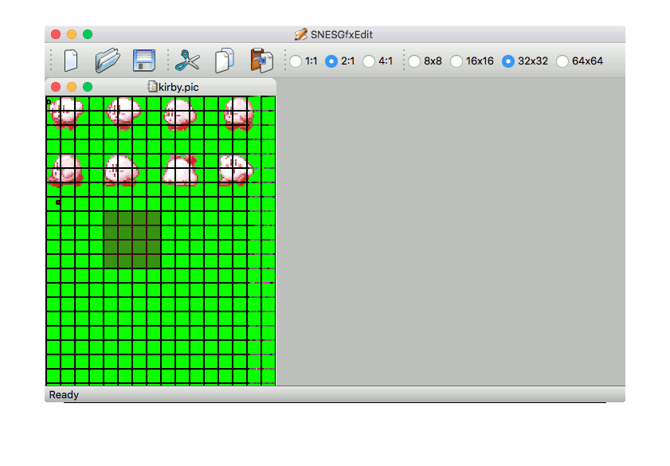

# SnesGfxEdit

SnesGfxEdit was inspired by my toils learning to program the Super Nintendo. Using command line tools such as [pcx2snes](https://github.com/bazzinotti/pcx2snes) to export graphics for SNES did not always conclude as expected. I wished for a way to graphically work with that data.

This tool allows the user to visually confirm the correctness of raw graphics data meant to be uploaded to SNES VRAM, and provides facilities to effortlessly re-organize the data at will, as you can see from the below animation.



## Building

First, ensure that you have qt5.

As a QT Project, it's multi-platform. However, I currently only provide build instructions on Mac.

Simply run

```
make_xcode_project
xcodebuild -project SnesGFXEdit.xcodeproj`
```

I speculate on Linux:

```
qmake
make
```

;)
